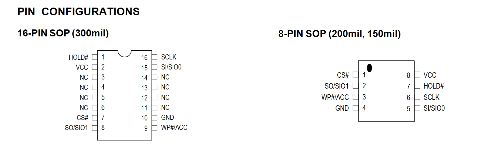

# LibrebootTutorial
**READ: (This tutorial is in progress and as of now not complete)**

A small introduction and tutorial on some of the techniques used to disable Intel Management Engine in certain devices. This will be a brief overview of certain techniques involved in the process of Librebooting a machine. As always, continue at your own risk. I am not liable for any damage you cause to hardware, I will provide some sources in this documentation for further research.

As always, more information on hardware specifications and firmware may be found at: https://libreboot.org/

Why would you want to disable to Intel Management Engine? There are certain vulnerabilities found in older firmware versions of the BIOS that may be used as attack vectors to escalate privileges. Here are some sources below you can look at:

https://www.intel.com/content/www/us/en/security-center/advisory/intel-sa-00075.html
https://www.intel.com/content/www/us/en/support/articles/000025619/software.html

Tools Required: This will solely depend on the hardware. To find out the specific hardware you need for Libreboot, be sure to check this documentation: https://libreboot.org/docs/hardware/

Tools used:
- CH341A USB Flasher w/ SOIC-8 clip adapter. You may need a SOIC-16 clip instead based on the hardware you are modifying.

- A machine running linux with flashrom application.

- Official Libreboot rom from: https://libreboot.org/download.html#git-repository

Some devices do not require any external devices to flash the BIOS, and it can be simply done by software (Such as the Thinkpad X200). Some devices will require certain hardware to flash the BIOS chip, and it depends on how the motherboard of the device is designed.

For this tutorial we will be using a CH341A flasher. It's a relatively cheap solution, and it is easy to find on major e-commerce platforms such as Amazon and Aliexpress. 

(CH341A USB Flasher)

A difference to be aware of is the type of flash chip used. 

SOIC-8 has 4 pins on the side, SOIC-16 has 8 pins on the side. This is important to recognize, as this will dictate what connector you use with your CH341A flasher. 

You will need to find documentation online to properly align your pins with the bios chip. A good source to find out what you need is: https://www.alldatasheet.com/ An example is seen below for the MX-25L6405D chip. 

Once you have properly aligned your clip with the chip, you want to read the contents using flashrom. You can do so inputting 
flashrom --programmer ch34a1_spi -r read1.bin

(Note: If you are using a different progammer, be sure to specify that after --programmer. You could name your dump whatever you would like, it does not need to be read1.bin)

Be sure to record the size of the dump. In this case, 8192 kB, which is 4MB. This size will dictate which firmware you will use. For this case, it's the 4MB version.

Once you have installed the official rom from the repository, you are able to write to the chip using in this case:

flashrom --programmer ch34a1_spi -w (name of whichever rom you have downloaded)

Once you have written sucessfully to the chip, you now have device which has been librebooted. Congratulations.
